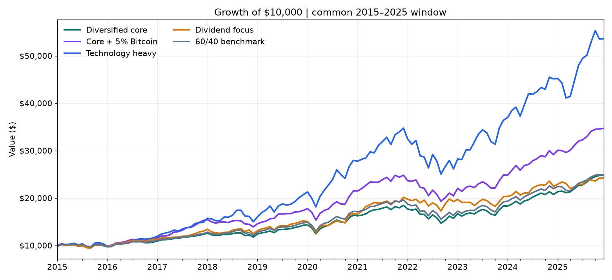
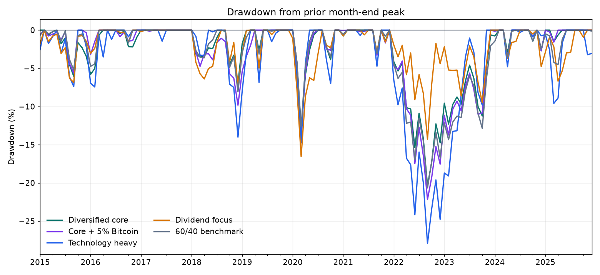
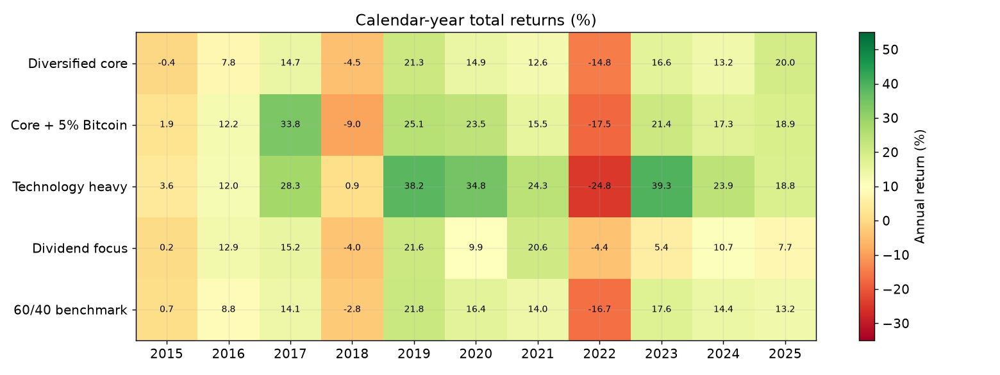
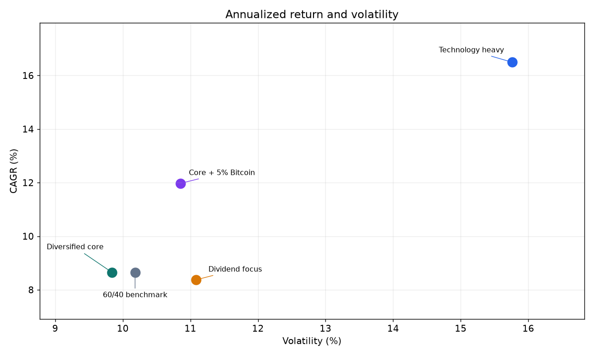

# Multi-asset portfolio backtest

## Client proposal

Client: age 40, 15+ year horizon, moderate risk tolerance, no near-term withdrawals. Starting balance $10,000.

### Proposed diversified core

| Sleeve | ETF proxy | Target | Role |
|---|---|---:|---|
| US equities | VTI | 40% | Broad domestic growth |
| Developed international equities | VEA | 15% | Geographic diversification |
| US investment-grade bonds | BND | 25% | Income and rate exposure |
| Gold | GLD | 10% | Alternative asset and inflation sensitivity |
| US REITs | VNQ | 5% | Listed real estate exposure |
| Short-term US Treasuries | SHY | 5% | Cash-like reserve proxy |

### Alternative strategies for discussion

These illustrate different objectives and risk exposures; the historical comparison below does not establish that any alternative is suitable for this moderate-risk client.

| Strategy | Proposed allocation | What changes |
|---|---|---|
| Core + 5% Bitcoin | 35% VTI, 15% VEA, 25% BND, 10% GLD, 5% VNQ, 5% SHY, 5% BTC-USD | Funds Bitcoin by reducing the core's VTI weight from 40% to 35%; adds substantial crypto risk. |
| Technology heavy | 65% VGT, 20% VTI, 10% BND, 5% SHY | Concentrates in the US information technology sector and US stocks. |
| Dividend focus | 50% SCHD, 25% VYM, 20% BND, 5% SHY | Tilts toward dividend-oriented US stocks; backtest assumes distributions are reinvested. |
| 60/40 benchmark | 60% VTI, 40% BND | Simple stock/bond comparison, not a client recommendation. |

## Method

Adjusted monthly closes from Yahoo Finance, December 2010–December 2025. Returns include the provider's distribution and split adjustments. Invest at the December 2010 close, rebalance to fixed weights at each month end, and measure January 2011–December 2025. Benchmark: 60% VTI / 40% BND, same rebalance schedule. No fees, taxes, slippage, cash flows, or inflation adjustment. SHY is a short Treasury ETF, not a bank cash account. Sharpe uses a zero risk-free rate for transparent comparison; use an actual cash rate for an investment-grade Sharpe calculation. Results are hypothetical and depend on the selected proxies and period.

## Results

| Metric | Multi-asset | 60/40 benchmark |
|---|---:|---:|
| Ending value of $10,000 | $34,046 | $37,335 |
| CAGR | 8.51% | 9.18% |
| Annualized volatility | 9.41% | 9.43% |
| Sharpe (0% risk-free) | 0.92 | 0.98 |
| Maximum drawdown (month end) | -20.36% | -20.66% |
| Positive months | 66.7% | 68.3% |

## Scenario results

The [scenario notebook](scenario_comparison.ipynb) compares five portfolios over the **same January 2015–December 2025 window** (132 monthly returns). This shorter period accommodates Bitcoin price history. Each starts at $10,000 and is rebalanced monthly. The original 2011–2025 analysis above remains unchanged; its ending values should not be compared directly with the 2015–2025 values below.

| Portfolio | CAGR | Volatility | Sharpe (0% RF) | Max month-end drawdown | Positive months | Ending $10,000 |
|---|---:|---:|---:|---:|---:|---:|
| Diversified core | 8.65% | 9.84% | 0.90 | -20.36% | 68.18% | $24,915 |
| Core + 5% Bitcoin | 11.98% | 10.86% | 1.10 | -22.17% | 66.67% | $34,703 |
| Technology heavy | 16.50% | 15.76% | 1.05 | -27.94% | 64.39% | $53,627 |
| Dividend focus | 8.37% | 11.08% | 0.78 | -16.56% | 64.39% | $24,215 |
| 60/40 benchmark | 8.65% | 10.18% | 0.87 | -20.66% | 67.42% | $24,899 |

Sharpe uses a 0% risk-free rate; positive months is the share of the 132 months with a return above zero.

The technology portfolio had the highest historical return and the deepest drawdown. Adding 5% Bitcoin raised historical CAGR but also volatility and maximum drawdown. The dividend-focused portfolio had the smallest maximum month-end drawdown in this sample; its adjusted-price results measure **total return with dividends reinvested**, not cash dividend income or yield. These allocations are illustrative and were not optimized. Bitcoin trades continuously whereas ETFs trade on exchange days, so monthly observations are not perfectly synchronized.

To rerun the comparison, install `requirements.txt` in your Python environment and open `scenario_comparison.ipynb` from this project folder. The calculation module can also be run directly with `python scenario_comparison.py`. The notebook contains growth, drawdown, annual-return, and risk/return charts and does not overwrite the existing CSVs. Data sources and fund descriptions: [Yahoo Finance BTC-USD history](https://finance.yahoo.com/quote/BTC-USD/history/), [Schwab SCHD profile](https://www.schwabassetmanagement.com/products/schd), [Vanguard ETF list for VGT and VYM](https://investor.vanguard.com/investment-products/list/etfs).

## Portfolio charts

These charts compare all five portfolios over **January 2015–December 2025**, using the same $10,000 starting investment and monthly rebalancing as the scenario results. They are saved outputs from the [scenario notebook](scenario_comparison.ipynb).

### Growth of $10,000

The technology portfolio accumulated the most wealth, followed by the core with 5% Bitcoin. Compare these gains with the losses and volatility shown below.

### Drawdowns

The technology portfolio experienced the deepest month-end drawdown. The dividend-focused portfolio had the smallest maximum drawdown in this sample; these observations do not set a limit on future losses.

### Annual returns

The heatmap shows how leadership changed across years. In 2022, every portfolio lost value, with the dividend-focused strategy declining the least. Exact percentages appear in the annual returns table below.

### Return and volatility

The technology portfolio paired the highest CAGR with the highest volatility. The Bitcoin variant increased both return and volatility relative to the diversified core.

## Annual returns

The original diversified core and 60/40 benchmark cover 2011–2025. New strategy columns begin in 2015, the shared comparison period required by the Bitcoin history. A dash means the strategy was not evaluated for that year in this comparison.

| Year | Diversified core | Core + 5% Bitcoin | Technology heavy | Dividend focus | 60/40 benchmark |
|---:|---:|---:|---:|---:|---:|
| 2011 | 2.40% | — | — | — | 4.06% |
| 2012 | 11.76% | — | — | — | 11.03% |
| 2013 | 11.83% | — | — | — | 18.09% |
| 2014 | 6.77% | — | — | — | 9.90% |
| 2015 | -0.35% | 1.94% | 3.59% | 0.23% | 0.67% |
| 2016 | 7.76% | 12.18% | 11.96% | 12.95% | 8.79% |
| 2017 | 14.73% | 33.78% | 28.25% | 15.16% | 14.06% |
| 2018 | -4.45% | -8.98% | 0.87% | -3.99% | -2.83% |
| 2019 | 21.27% | 25.10% | 38.24% | 21.56% | 21.80% |
| 2020 | 14.91% | 23.48% | 34.78% | 9.94% | 16.40% |
| 2021 | 12.57% | 15.48% | 24.34% | 20.56% | 14.04% |
| 2022 | -14.75% | -17.54% | -24.77% | -4.41% | -16.70% |
| 2023 | 16.56% | 21.41% | 39.33% | 5.36% | 17.61% |
| 2024 | 13.19% | 17.33% | 23.93% | 10.66% | 14.44% |
| 2025 | 19.95% | 18.95% | 18.76% | 7.74% | 13.17% |

## Interpretation

The results show that the highest return, the lowest volatility, and the smallest drawdown came from different portfolios. Over the full 2011–2025 period, the diversified core returned 8.51% annually versus 9.18% for the 60/40 benchmark, with almost identical volatility. Diversification across more asset classes therefore did not deliver a clear performance advantage over that entire sample. In the shared 2015–2025 comparison, both returned approximately 8.65% annually, while the core had slightly lower volatility and a marginally smaller maximum drawdown.

Adding 5% Bitcoin increased annualized return to 11.98% and produced the highest Sharpe ratio in the comparison at 1.10, using the stated 0% risk-free assumption. That improvement came with higher volatility and a deeper maximum drawdown of 22.17%, compared with 20.36% for the core. The Bitcoin variant also had fewer positive months. Its historical advantage depends on the selected period and on repeatedly rebalancing Bitcoin back to 5%; it does not establish that the same benefit would persist in future markets.

The technology-heavy portfolio generated the highest annualized return, 16.50%, but also the highest volatility, 15.76%, and the deepest maximum drawdown, 27.94%. Its 24.77% loss in 2022 illustrates the downside of concentrated exposure, alongside strong gains such as 39.33% in 2023. This strategy increased both the opportunity for growth and the size of losses the hypothetical client would have needed to tolerate.

The dividend-focused portfolio returned 8.37% annually and had the smallest maximum drawdown, 16.56%. It also held up best in 2022, losing 4.41%. However, its volatility was higher than the core's and its Sharpe ratio was the lowest of the five portfolios at 0.78. A smaller worst drawdown did not translate into lower volatility or a higher risk-adjusted return. These figures include reinvested distributions and do not measure cash income, dividend yield, or the reliability of future payments.

For the hypothetical client, these comparisons frame a discussion about growth objectives and tolerance for losses. The core had the highest share of positive months, while the technology portfolio delivered much greater cumulative growth despite fewer winning months; the size of gains and losses matters as well as their frequency. Strategy comparisons should use the shared 2015–2025 window, and maximum drawdown should be read as an observed month-end loss rather than a limit on future losses. The results describe the selected assets and historical period, with the cost, tax, and measurement assumptions stated above.

## Data and reproducibility

Source: [Yahoo Finance historical data help](https://help.yahoo.com/kb/sln2311.html). Raw Yahoo chart API responses are retained in `data/`. Run `python backtest.py` to regenerate the CSVs and this report. The CSV contains every monthly adjusted close, asset return, portfolio return, and wealth path. Figures may change if the data provider revises adjusted history.
